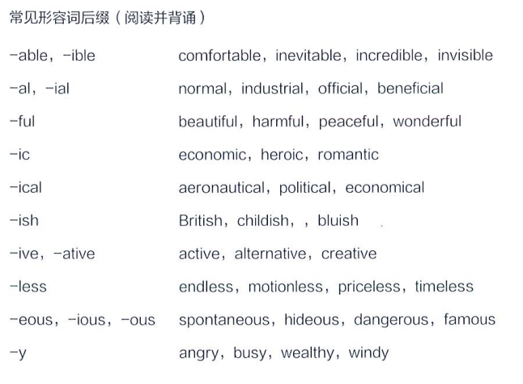

<!-- more -->

# 形容词

## 分类

**常见形容词后缀**

形容词的分类

1. 属性形容词
2. 类属形容词
3. 颜色形容词
4. 强调形容词
5. ing & ed形容词
6. 复合形容词

### 属性形容词

active 主动的，活跃的

adroit 灵巧的，机敏的

aggressive 有进取心的

ambitious 有雄心壮志的

amiable 和高可亲的

analytical善于分析的

apprehensive有理解力的

aspiring有志气的，有抱负的 

audacious 大胆的，有冒脸精神

capable有能力的，有才能的

candid 正直的宽厚的

competent 能胜任的

cunning 狡拥的

confident 自信的

conscientous 认真的，自觉的

considerate 体贴的

constructive 建设性的好沉思的

operative 有合作精神的

dedicated 有拼搏精神的有奉献精神的

devoted 有献身精神的

disciplined 守纪律的

discreet 谨慎的

dutiful 尽职的

dynamic 精悍的

earnest el-educated 受过良好教育的

efficient 有效率的

elegant 精力充沛的充满热情的

expressive 善于表达

frank 直率的，真诚的

grinning 靠齿而

generous 宽宏大量的

注意:属性形容词前可加“rather"或"very”修饰。

Actually，I did rather well in my exams.

实际上我各科考试发挥得很好。

The situation is very serious.

形势非常严峻。

### 类属形容词

| financial  | electric     | classic  | central     | modern    | international |
| ---------- | ------------ | -------- | ----------- | --------- | ------------- |
| economic   | intellectual | historic | proper      | legal     | internal      |
| annual     | alternative  | blind    | social      | local     | external      |
| domestic   | considerable | ideal    | rural       | separate  | empty         |
| industrial | official     | basic    | traditional | potential | inevitable    |

​    

注意：
（1）表示**国籍**的词属于类属形容词

British island  英国岛屿

American people  美国人

（2）类属形容词没有比较级与最高级，**前可不加"rather”或"very”修饰**

### 颜色形容词

blue  蓝色 ;green  绿色 ; purple 紫色 ; yellow 黄色 ; red红色 ; pink 粉红色 ; brown 褐色 ; black 黑色 ; grey 灰色 ; white 白色 ; orange 橙色;

表示**浅色**可在颜色形容词前加“light"，**深色**可在颜色形容词前加“dark”或"deep"，另外可用“pale，bright”等词。

light brown 浅褐色

light green 浅绿色

dark blue 深蓝色

### 强调形容词

常见的有：absolute，utter，total，entire，sheer等。

We have absolute confidence in victory.

我们有绝对胜利的把握。

This is a sheer fabrication.

这完全是凭空捏造。

### -ing形容词-ed形容词

详见非谓语动词

### 复合形容词

复合形容词常见形式：（阅读并背诵）

1）形容词+名词+-ed

2）形容词/副词+过去分词

3）形容词/副词/名词+现在分词

He is a we‖-known writer.他是一位知名的作家。

That was a record-breaking jump.那是破纪录的一跳。

She is a world-famous singer.她是世界有名的歌唱家。

It was a last-minute decision.最后一刻才做的决定。

That is an old-fashioned dress.那是一条过时的裙子。

She is a good-looking gir.她是一位长相漂亮的女孩子。

> 在冠词和名词之间必定是形容词

## 形容词的词序

1）限定词：a，an，the，my，your，four，those，some等

2）描绘性形容词：beautiful，boring，stupid，delicious，useful，lovely，comfortable等

3）大小：big，smal，tall，huge，tiny

4）形状、重量、长短：round，square，circular，skinny，fat，heavy，straight，long，short

5）状态：broken，cold，hot，wet，hungry，rich，easy，difficult，dirty

6）年龄：old，young，new，ancient，antique

7）颜色：green，white，blue，reddish，purple

8）图案：striped，spotted，checked，flowery

9）国籍：American，British，Italian，eastern，Australian，Chilean

10）物质材料：god，wooden，silk，paper，synthetic，cotton，woolen

11）类别或用途：sleeping（bag），wedding（dress）

限描大；形龄颜；籍材类

A pretty little square old black Japanese wooden writing desk.

## 形容词的句法功能

- 作定语。
  
  It is big fat dog.  是一只又大又胖的狗。
  
  The car is big enough. 这台车足够大。
  
  - 作表语。

      The news is exciting.   这个消息振奋人心。

      The garden is completely dry.  这个花园完全干掉了。

- 作补语
  Money doesn't always make us happy. 钱不总是让我们开心。

  Noises drive me crazy. 噪音快让我疯了。

  The door was found open. 门被发现开着。

- 作状语

  He arrived home，hungry and tired. 他回到家，又饿又累。

  Hard to say，he is a mild boy. 很难说他是一个温和的人。

- The+形容词表示某一类人

  the rich   富人

  the poor  穷人

  the old 老人

  the young 年轻人

## 形容词的原级、比较级与最高级

**规则变化**

| 规则                                                         | 原级                 | 比较级                | 最高级                   |
| ------------------------------------------------------------ | -------------------- | --------------------- | ------------------------ |
| 单音节词节词及少数双音节词的比较级直接后加-er，-est          | clean  warm          | cleaner  warmer       | cleanest  warmest        |
| 元音+辅音字母结尾，辅音字双写后加-er，-est                   | hot big              | hotter bigger         | hotter biggest           |
| 单音节如以e结尾，后只加-r，-st                               | nice wide            | nicer wider           | nicest widest            |
| 以-y结尾的词，如-y前是辅音字母，则变y为-i，再加-er和-est，如果y前为元音，则直接加-er和-est | busy happy     gay   | busier happier grayer | busiest happiest grayest |
| **多音节和双音节**词前加 more和most                          | beautiful  important | more ~                | most ~                   |
| -ing形容词，-ed形容词前加more和most                          | interesting excited  | more ~                | most ~                   |

We were busier last week than this week. 我们上周比这周忙。

That was the easiest exam I've ever taken.  这是我参加过的最简单的考试了。

This dictionary is more useful than the one we had before. 这本字典比我们之前的有用。

**不规则变化**

| 原级      | 比较级          | 最高级            |
| --------- | --------------- | ----------------- |
| good/well | better          | best              |
| bad       | worse           | worst             |
| many/much | more            | most              |
| little    | less            | least             |
| far       | farther/further | farthest/furthest |
| old       | older/elder     | oldest/eldest     |

## 形容词比较级的用法

1. 单独使用，前可以加修饰语。

a lot ; much;a little; a bit ; far; by for; a great of; any; rather; 及表示数量的词。

You should be more careful.  你应该更小心点。

The city is a lot more crowded these days.  这个城市这几天过于拥挤。

2. 与than连用，表两者比较

It is more stressful than simultaneous interpreting. 它比同声传译压力更大。

It was much further to the town center than i remembered. 去市中心的路比我印象中要长得多。

3. 其他特殊结构

   **more and more 结构 “越来越”**

The weather is getting hotter and hotter. 天气越来越热。

The country is becoming more and more prosperous. 这个国家越来越繁盛了。

​		**the more...the more 结构**

The longer the war lasts，the more the people suffer. 战争持续越久，人们受难就越多。
The thicker a mammals skin is，the less hair it has. 哺乳动物的皮越厚，毛发越稀疏。

> The more you eat the heavier you are.

​		**more than 结构**

​		more than + 名词   =  not only

​		more than + 数词   =  over

​		more than + 形容词 = very

Hibernation is more than sleep. 冬眠不仅仅是睡觉。

More than 10 million has witnessed tremendous changes. 超过1000万人见证了巨大的变化。

They are more than happy to see us. 见到我们，他们非常高兴。

​		**more ...than**

​		比..多

​		与其...不如

The book is more useful than that one. 这本书比那本书有用。

She is more a singer than an actress. 与其说她是个演员，不如说是个歌唱家。

​		**no more than 与 not more than**

​		no more than 仅仅只有  =

​		not more than 不超过，不多于 <=

She has no more than three books. 她只有3本书。

She has not more than three books. 她至多有3本书。

​		**no more ...than 与 not more ...than**

​		no more .... than  “既不....也不”  = nether ... nor

​		not more.... than “不如，不及”   = not so ... as

He is no more a musician than a painter.  他既不是音乐家，也不是作家。

She is not more diligent than he is.  她不如他勤奋。

​		**less than “少于”**

The interest for music had lasted for less than two years. 

对音乐的兴趣维持了不到两年。

​		**no less than “多达”**

We ran no less than three miles.

我们跑了3英里之远。

​		**no less ... than 和... 一样**

He is no less clever than you. 他跟你一样聪明。

​		**not less than 不少于**

He has not less than seven cars. 他至少有七辆车。

## 形容词最高级的用法

1. 前一般加 the

He is the strongest student in his class. 

他是班里最强壮的学生。

What is the least expensive way of travelling in UK？

游览英国最便宜的方式是什么？

2. 可单独使用

Mary is my best friend. 

玛丽是我最好的朋友。

She's the youngest musician in the piano.

她是钢琴界最年轻的音乐家。

> 限定词代词和冠词不可能同时出现

3. 最高级前可以添加修饰语

   far,most,almost,by far,very,much,quite等

This method is by far the least complicated.

这个方法是目前为止最简单的。

This is quite the most irresponsible behavior I have ever seen.

这是我见过的最不负责任的行为。

4. at + 形容词最高级

   表“处于最.....的状态”

I knew she was at her worst.

我知道她这时情绪最糟。

The game was at its peak.

游戏正是高潮的时候。

> at my best

5. 形容词前加 a most 时意为“非常”

It is a most important occasion.

这是一个非常重要的时刻。

It was a most beautiful morning.

那是个十分美丽的早晨。

> absolutely extremely 十分非常

# 副词

## 副词分类

1. 时间副词

   表示时间

tomorrow, now, this year, next week, soon, then, yesterday, lately, recently, immediately

> 时态由时间状语决定

I will see you tomorrow.明天见。

I never get up early at the weekends.我周末从来不早起。

​	频率副词，表示频繁程度

always, sometimes, never, once a week, hourly, every day, once a month, twice a year, four times a day, every other week, daily, monthly

I always go to bed before 11 p.m.

一般在11点前我就睡觉了。

I'm usually home by 6 o'clock.

我一般6点前到家。

**频度比较**

| 100% | always             |
| ---- | ------------------ |
| 90%  | usualy             |
| 80%  | normally/generally |
| 70%  | often/frequently   |
| 50%  | sometimes          |
| 30%  | occasionally       |
| 10%  | seldom             |
| 5%   | hardly ever/rarely |
| 0%   | never              |

2. 地点副词

   表示地点

here, there, everywhere, inside, outside, home, upstairs downstairs, across, along, round, around, in, out, above, below up, down, back, forward

You should go upstairs and do your homework. 

你应该上楼去写作业。

The author's name was printed below the title.

作者的名字登在标题之下。（介词）

The cars below looked like insects.

下面的汽车像昆虫一样。（副词）

They live in that old house on the hill.

他们住在山上的那间旧农舍里。（介词）

It's very cold so put a coat on.

天很冷，穿上一件外套吧。（副词）

3. 方式副词

Can you move it carefully？

你能慢点挪动它吗？

Walk slowly. 慢点走。

The boring speech finished and everyone clapped politely.

这个无聊的演讲结束了，每个人礼貌地鼓了鼓掌。

4. 程度副词

very，extremely，rather，almost，nearly，too，fully，absolutely，slightly simply 

I'm not very impressed.

我一点儿印象有没有。

He was conscious that he was talking rather too much.

他意识到他说的太多了。

The bottle's nearly empty.

这个瓶子快空了。

5. 疑问副词

how, when, where, why

How does it work？

它是怎么工作的？

len can I see you？

我什么时候能见你？

Where do you live？

你住在哪儿？

Why are you late?

你为什么迟到？

6. 强调副词：强调动词，形容词

absolutely，completely，entirely，just，perfectly，purely , quite，really.
totally，utterly，really，especially，mainly，particularly，generally , largely，only 

The lecture was not particularly interesting.

这次的课不是特别有趣。

I love Rome，especially in the spring.

我喜欢罗马，尤其是春天的罗马。

This behavior is totally unacceptable.

完全不能接受这样的行为。

7. 连接副词

how，when，where，why

​	**用来引导主语从句，宾语从句，表语从句**

Do you remember how the kids always loved going there？

你记得孩子们是怎么样爱上去那里的吗？

I wonder where they will take us to.

我在想他们会带我们到哪里去。

That's why I left so early.

这就是我为什么早早离开。

​	**引导并列结构**

用来引导并列结构：then，however，consequently，therefore等

He drank a glass of whisky，then another and then another.

他喝了一杯威士忌，然后一杯接一杯。

We thought the figures were correct. However，we have now discovered some errors.

我们认为数字是正确的，然而，我们现在发现了错误。

8. 关系副词：用来引导定语从句

When，where，why It's one of the few countries where people drive on the left.

它是少数人们可以左驾的国家之一。

There are times when I wonder why i do this job.

好几次我都想为什么我要做这份工作。

The reason why he disappeared is under inspection.

他失踪的原因正在调查中。

9. 句子副词：修饰整个句子

apparently，actually，chiefly，chiefly，interestingly

Personally，I think the show was great.

个人来讲，我认为这个表演很不错。

Actually，I've been very busy.

说实话，我很忙。

## 副词的构成

